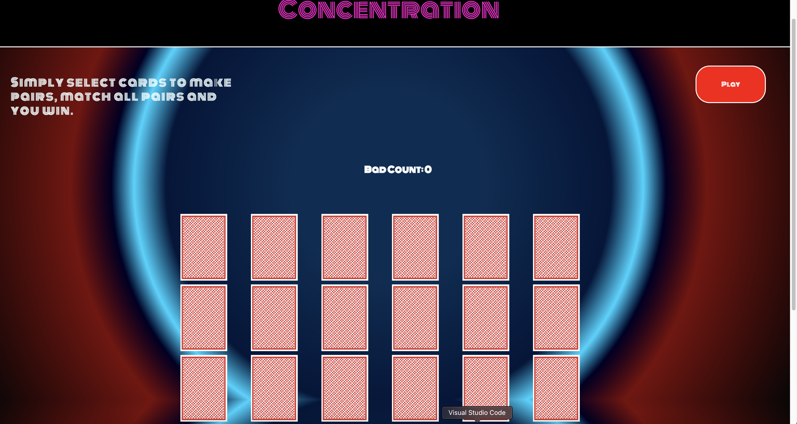

   <h1>ConcentrationSuzuki </h1>
   <h3></h3>
   <h5> Matthew Suzuki </h5><a>https://mattsuzuki.github.io/ConcentrationSuzuki/</a>                             

<h1> Instructions</h1>

Concentation is a game in which the player selects a facedown card which will show a value, if the player makes a match then the player has successfully made a pair. If the player finds all the pairs then the player wins the game.

 
<h1>Technologies Used</h1>
:computer: 

- HTML5

- CSS 

- JavaScript

- VSCode

- Git

- Github

<h1>Game Layout</h1>

<h1> Future Features </h1>

 - Implementing a timer to end the game if the player exceeds a certain amount of time to win the game. 

 - Placing an input for players to track their scores relative to other players who have played.

 - Adding background music 

 - Creating a background animation to make it have a "breathing effect"

